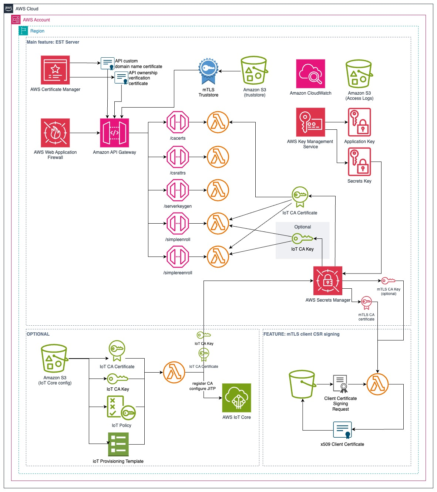

# Welcome to the EST Server for AWS IoT

This CDK application deploys an Enrollment over Secure Transport (EST) server, which is a way for an IoT device to obtain
a certificate without exposing any secret and without human intervention. It makes Zero-Trust and Zero-Touch possible.

The EST Server has been developed to be compliant with [[RFC7030](https://datatracker.ietf.org/doc/html/rfc7030)] and it
entirely "serverless".
Note that *Explicit trust anchor* is not implemented. You'll have to use *the Implicit trust anchor*, meaning 
that the EST server Certificate will have to be known in advance by the device.

In addition, it provides features which will facilitate the management of IoT devices like enabling Just In Time 
Provisioning (JITP). You will also find a lambda allowing to sign client CSR for mTLS with API Gateway.

The multiple options available will hopefully allow you to configure the EST service according to your use case, and
in just a few minutes. We will go in details in the next sections, but for now lets take care of the impatient ones.

## Content
<!-- TOC -->
* [Welcome to the EST Server for AWS IoT](#welcome-to-the-est-server-for-aws-iot)
  * [Content](#content)
  * [Flash Start](#flash-start)
    * [You don't have any Root CA Certificate except for API Gateway custom domain name](#you-dont-have-any-root-ca-certificate-except-for-api-gateway-custom-domain-name)
    * [You already have a CA Trust Chain for mTLS and you use an external PKI for signing the devices](#you-already-have-a-ca-trust-chain-for-mtls-and-you-use-an-external-pki-for-signing-the-devices)
    * [Pro-tips](#pro-tips)
    * [About re-enrollment](#about-re-enrollment)
  * [Setting-up your environment](#setting-up-your-environment)
    * [Pre-requisites](#pre-requisites)
    * [Clone the repo](#clone-the-repo)
    * [Install dependencies](#install-dependencies)
    * [Deployment commands](#deployment-commands)
    * [IMPORTANT](#important)
  * [Establishing the bases](#establishing-the-bases)
    * [Everything related to the IoT Operations](#everything-related-to-the-iot-operations)
    * [A server or an API must be secure](#a-server-or-an-api-must-be-secure)
    * [The users of the EST Server also need to be identified](#the-users-of-the-est-server-also-need-to-be-identified)
  * [Understanding the application features and architecture](#understanding-the-application-features-and-architecture)
    * [Features](#features)
    * [Architecture](#architecture)
    * [Security & Compliance](#security--compliance)
  * [Application configuration & associated features / behaviour](#application-configuration--associated-features--behaviour)
    * [Properties](#properties)
    * [Deployment options](#deployment-options)
      * [API Gateway Truststore](#api-gateway-truststore)
      * [IoT Core CA parameters](#iot-core-ca-parameters)
      * [Just in Time Provisioning (JITP)](#just-in-time-provisioning-jitp)
  * [Additional features](#additional-features)
    * [Reenrollment](#reenrollment)
    * [Pre / Post (re)enrollment hooks](#pre--post-reenrollment-hooks)
    * [Tenant](#tenant)
    * [Updating the IoT CA and JITP](#updating-the-iot-ca-and-jitp)
    * [Updating the mTLS configuration](#updating-the-mtls-configuration)
  * [Customisation](#customisation)
    * [Customise the device CSR signing with you own PKI](#customise-the-device-csr-signing-with-you-own-pki)
    * [Enrollment hooks](#enrollment-hooks)
    * [Re-enrollment hooks](#re-enrollment-hooks)
  * [Testing your deployment](#testing-your-deployment)
<!-- TOC -->

## Flash Start
If you don't know what an EST Server is and/or you are not familiar with the AWS Cloud Development Kit (CDK) nor 
AWS services (Amazon API Gateway, Amazon S3, AWS Iot Core, AWS Certificate Manager ) stop reading and skip to the next 
sections.

1. Clone this repo on your development environment
1. Log-in your dev environment on you AWS account
1. Get a certificate for the API Gateway (AGW) custom domain name
1. If you didn't use AWS Certificate Manager (ACM) to generate the certificate:
   1. Import it in ACM and not its ARN.
   1. Request an [ownership verification certificate](https://docs.aws.amazon.com/acm/latest/userguide/domain-ownership-validation.html) 
      from ACM, as [this is required by AGW](https://docs.aws.amazon.com/apigateway/latest/developerguide/http-api-mutual-tls.html).
   

You have 2 options for quick start, depending on how you will handle mTLS for the EST server, IoT device certificate
signing and JITP.

### You don't have any Root CA Certificate except for API Gateway custom domain name
No worries, they will be generated for you

1. Copy the file `config/config-sample-all-generated.yaml` to `config/config.yaml`
1. Edit `config/config.yaml` looking for the strings in CAPITAL letter
   1. AGW domain name
   1. AGW domain certificate
   1. AGW ownership verification certificate
1. Check if the duration of the various certificates is suitable for your application (default 10 years)
1. Give a look at the IoT Provisioning Template `config/iot_template_default.json`, make a copy and modify as necessary
1. If you copied the Provisioning Template input its new path/name in the configuration file
1. Give a look at the IoT Policy `config/iot_policy_default.json`, make a copy and modify as necessary
1. If you copied the IoT Policy input its new path/name in the configuration file
1. `cdk deploy --all`

Et voilà!

* A self-signed Root CA Certificate has been generated with its private key. It will be used to sign the devices CSR.
All is stored in AWS Secrets Manager (ASM).
* A self-signed root CA has been generated and AGW configured to use it for mTLS. A client certificate, private key and 
pfx file have been generated and signed by this CA. They are all stored in ASM, and a set of sample client files is also
present in the Truststore bucket (see AWS CloudFormation stack outputs). You can install the client cert in postman for 
testing. Best is to have the client certs generated and signed at the device factory.

### You already have a CA Trust Chain for mTLS and you use an external PKI for signing the devices
In this case, you just have to pass the files in the config file. Make sure they are available locally in your dev
environment.

You'll have to implement the interface to your PKI... do you like python3? 

1. Copy the file `config/config-sample-all-external.yaml` to `config/config.yaml`
1. Edit `config/config.yaml` looking for the strings in CAPITAL letter
   1. AGW domain name
   1. AGW domain certificate
   1. AGW ownership verification certificate if required
   1. Path to your mTLS CA trust chain (to be provisioned in AGW)
   1. Path to your IoT PKI CA (to be provisioned in IoT Core)
1. Check if the duration of the various certificates is suitable for your application (default 10 years)
1. Give a look at the IoT Provisioning Template `config/iot_template_default.json`, make a copy and modify as necessary
1. If you copied the Provisioning Template input its new path/name in the configuration file
1. Give a look at the IoT Policy `config/iot_policy_default.json`, make a copy and modify as necessary
1. If you copied the IoT Policy input its new path/name in the configuration file
1. Open the file `layer/utils/est_common.py`
   1. Find the function `sign_externally` - this is where you will implement the interface to your external PKI.

### Pro-tips
The lambda `function/simpleenroll/lambda.py` has `pre_enroll` and  `post_enroll` functions which are placeholders to 
perform additional tasks. There you can, for example, check if a device is not in a forbidden list before signing it 
CSR and record the transaction in a DB... or anything else you like.

It is the same for `function/simplereenroll/lambda.py` with `pre_reenroll` and `post_reenroll`.

### About re-enrollment
The first time a device obtains a certificates and connects to IoT Core, it will be enrolled automatically by JITP.
Later on, when the device renews its certificate it will try to connect to IoT Core with this new certificate but would
fail if the new certificate has not been associated with the matching IoT Thing.
This application makes an attempt to find a matching IoT Thing and attach the new certificate to it. Of course, if this
EST server is not hosted in the same account and the IoT Things, it will fail (without raising an Exception). You will
then have to figure out how to do that!

## Setting-up your environment

### Pre-requisites
* Node.js version 18.x or above, as supported by the current version of aws-cdk (tested with 18.19)
* Python (tested with 3.12)
* You have fresh credentials to the target AWS Account

### Clone the repo
```bash
git clone git@github.com:aws-samples/UPDATE_ME
```

### Install dependencies
```bash
# Install the AWS CDK and the dependencies with Node.js
npm install
# Install the python3 packages required by CDK to generate the CloudFormation template
pip3 install -r requirements.txt
# If new account, you need to bootstrap the CDK (there is no risk to run it regularly...)
cdk bootstrap
```

### Deployment commands

```bash
cdk deploy --all
```
You can also specify a custom configuration file location:
```bash
cdk deploy --context configFile=my_custom_location/my_custom_config.yaml --all
```
You can find more commands nd options for `cdk` here: https://docs.aws.amazon.com/cdk/v2/guide/ref-cli-cmd.html

### IMPORTANT
This application CDK uses two Lambda Triggers to deploy resources that need contextual information or cannot expose
confidential information in the CloudFormation template that is generated by CDK. To avoid breaking the deployments
(which sometimes lead to broken stacks or complex situation) the Lambda Triggers try to return cleanly, even in case of
issue.

Thus, we strongly encourage you to inspect the CloudWatch logs of those Lambda Triggers after deployment to detect any
anomaly. Presence of absense of logs at the time of deployment will also indicate if the Lambda Triggers effectively ran, 
which is not always the case as explained [here](https://docs.aws.amazon.com/cdk/api/v2/docs/aws-cdk-lib.triggers-readme.html#re-execution-of-triggers).

In any case the Triggers have been designed to be idempotent and can be re-run without problem.


## Establishing the bases
This application is all about certificates and this can get confusing. So we need to define a terminology to limit the 
confusion. There are three groups of certificates involved:

### Everything related to the IoT Operations
We are here looking at IoT Core and the IoT Devices identification. The main purpose of an EST Server is "delivering
certificates to IoT devices" so they can start doing their job securely. When we will discuss this part of the application 
we will refer to it with the word "device" and/or "IoT". 
To operate securely IoT Core needs Certificate Authority (CA) registered. Then the IoT device can send a 
Certificate Signing Request (CSR) to receive in return a *Device Certificate* signed by the CA that was registered in IoT Core.
Note that it doesn't mean that the signature is effectively done by IoT Core. We'll get back to this later.

### A server or an API must be secure
This EST Server must also be secure, so it needs to have a Certificate of its own, which matches the domain name of 
the server. This "custom domain name" and certificate are installed in API Gateway so the clients can authenticate the
EST Server (the API in fact, since there is no webserver) and establish a trusted secure connection via TLS. 
Here we are referring to the "EST Server Certificate".

### The users of the EST Server also need to be identified
Finally, the [[RFC7030](https://datatracker.ietf.org/doc/html/rfc7030)] specification for EST also requires that the
clients be identified via mutual TLS (mTLS). It means that the client must present a certificate that is known by the
EST Server. In other terms the EST Server (API Gateway) must have a *Certificate Chain of Trust* which allows verifying
the certificate presented by the client. This *Certificate Chain of Trust* is called a *Truststore* in API Gateway 
terminology. 
The client must possess a *client certificate for mTLS* matching the *Truststore* (signed by one CA in the chain), 
which we will refer to as the *Client Certificate*. 

We are here looking at the calls to the EST API endpoints by the client. 
And this is not to be confused with the *Device Certificate* used for the IoT operations (interaction with IoT Core).
The mTLS and IoT certificates most likely come from two different Signing Authorities.

## Understanding the application features and architecture

### Features
The main goal of this code sample is to easily deploy an EST Server, a service which is capable of:
* Providing the current CA Certificate of the IoT Service (IoT Core in our case).
* Signing a CSR and returning the corresponding Certificate to an IoT Device for a first enrollment and a certificate 
renewal.

Signing a CSR for an IoT Device can be done locally on AWS or by an external PKI. This application allows both:
* If you are comfortable using a local PKI, it will create a self-signed Root CA and will use it to sign the Device
 Certificates
* If you prefer to use an external CA, you will provide the CA Certificate of your PKI, and it will be registered  
in IoT Core. You will have to implement the interface to your external PKI (more on this later).

As we saw earlier, mTLS requires a Truststore and matching client certificates. You also have two options here:
* Recommended: your mTLS Client Certificates are generated at the factory during the configuration of the IoT Device 
by your own PKI. In this case you just have to provide the Truststore as
[documented by API Gateway](https://docs.aws.amazon.com/apigateway/latest/developerguide/rest-api-mutual-tls.html).
* For testing: you can also create a PKI for mTLS Certificates generation. In this case you will be able to generate 
mTLS client certificates (sign a CSR) with the serf-signed root CA that was created for you. 
Signing an mTLS CSR is a manual action and a Lambda function is provided for this.

* Just in Time Provisioning (JITP): JITP is a feature of AWS IoT Core allowing a new device to be automatically
provisioned at first connection. When a valid certificate, signed by the CA registered in IoT Core, is presented by a new 
device, IoT automatically provisions the device according to pre-configured provisioning template and IoT policy. More
details are available [here](https://docs.aws.amazon.com/iot/latest/developerguide/jit-provisioning.html). By setting the
configuration parameter `configureJITP` to `true` JITP will be configured in the account when the CDK is deployed.

All the above feature options are controlled by a few configuration parameters of the configuration file you'll have to 
create. This is the single point of configuration, except if you need to use an external PKI for signing the IoT Device CSR,
in which case you also have to implement this interface.

### Architecture
This CDK application deploys serverless AWS resources, limiting the run costs of the service and reducing the efforts to keep
it secure and up-to-date. The Lambda functions are writen in Python 3.


### Security & Compliance
The entire application is encrypted by a custom key stored in KMS.
The "secrets" (keys and certificates, although these certificates are not strictly secret) are stored in ASM and 
encrypted with a different custom KMS key, except for the API custom domain names certificates provided by ACM.

API Gateway is fronted by AWS Application Firewall with the AWS Managed Common Rules Set (can be changed in
[API base construct](lib/api-base-construct.ts)). The execution API endpoint is disabled, so the only access is via the 
custom domain name and mTLS.

All Lambda functions and API Gateway log in CloudWatch. All S3 buckets have access logs pushed to an S3 bucket.

IAM roles use policies following the least privilege approach wherever possible (some deployment constructs create
their own and sometimes use wildcards).

The CDK code uses [cdk-nag library](https://github.com/cdklabs/cdk-nag) to enforce best practices.

All the deployed resources are tagged with `APPLICATION=EST Server for AWS IoT`.

Code assessment using cdk-nag, bandit and pip-audit

[](https://github.com/PyCQA/bandit)

## Application configuration & associated features / behaviour
The configuration of the application before deployment is done via a single YAML configuration file `config/config.yaml`
by default. You can specify a different configuration file as explained in [the section 'Deployment commands'](#deployment-commands).
The configuration file is split in two sections:
* Properties: contains parameters that do not influence the resources that will be deployed.
* DeploymentOptions: depending on the values provided (or not) in this section, some resources will be deployed or not.

### Properties
In most cases you only need to provide the API Gateway custom domain name, the ACM ARN of the Certificate for this 
custom domain name and, if applicable, the ARN for the ownership verification certificate.
If you plan to let the deployment configure JITP, you will also have to provide the path to your provisioning template
and IoT policy, or modify the files provided in the config directory.

During testing we noticed that some devices do not comply with the headers requirements of [[RFC7030](https://datatracker.ietf.org/doc/html/rfc7030)]. To avoid
blocking you can disable the header checks from the config file. The responses provided by the EST server will still
comply with the standard but the caller headers will be ignored. Note that WAF2 is also checking some headers. The rule
requiring presence of the `User-Agent` header has been disabled but other rules might block.

The other parameters are convenience:
* Validity duration of generated certificates can be adjusted according to your policies
* Names of important resources can be changed. This is particularly useful for the secrets in ACM which can only be deleted
after a minimum of 7 days and would block a re-deployment that affects them. Changing the secret names allows to not 
wait for a new deployment.

### Deployment options
The parameters in this section will affect what resources are deployed and what happens during the deployment.

#### API Gateway Truststore

[mTLS in API Gateway](https://docs.aws.amazon.com/apigateway/latest/developerguide/rest-api-mutual-tls.html) requires a 
Truststore document to be placed in S3 and associated in your custom domain name. If you provide a local path to an 
existing truststore document, the deployment will copy it to S3 and used it for configuring API Gateway.
Specify this path in `mTlsTruststoreCertificatesChainFile`.

If you do not provide the Truststore (use empty string ""), the deployment will:
* Create a self-signed CA certificate for mTLS
* Create a Truststore, place it in S3 and configure API Gateway accordingly
* Store the CA Certificate and Private Key in ASM
* Create a sample client certificate, key and pfx files and store them in S3 (same bucket as the Truststore 
under client/) as well as in ASM. Note that this is provided as a quick way to test the application and should not be
used for production due to security reasons.

A special Lambda function is provided for signing client certificates for mTLS. This, of course only works if the
CA certificate has been generated during deployment (the private key is known). 
* Usage: configure the environment variable "TRUSTSTORE_BUCKET" to point to an S3 bucket (pre-configured to the Truststore 
bucket) and make sure the Lambda function has read/write access.
* Place the CSR in the S3 bucket. You can use a directory.
* Configure a test event with a JSON event payload containing the key "csr_s3_key" with a value matching the S3 object 
key of the CSR in S3
* Run the Lambda function manually. It will write the signed certificate at the same location, with the extension `.crt`.

#### IoT Core CA parameters
Three parameters allow controlling how IoT CA will be configured: `iotCoreCaCertificatePath`, `iotCoreCaPrivateKeyPath`, 
`generateIotCaCertificate`.

`iotCoreCaCertificatePath` is the path to the CA certificate IoT Core will use to validate the device certificates. If
you provide a value here, the certificate will be stored in ASM for the API endpoint /cacerts. Optionally it will also 
be registered in IoT Core (see JITP section below).

If you do not provide any value. The ASM secret will still be created with the dummy value "NULL" but 
**YOU WILL HAVE TO UPDATE IT WITH THE CERTIFICATE CONTENT AFTER DEPLOYMENT** otherwise the API endpoint /cacerts will fail. 

`iotCoreCaPrivateKeyPath` is optional, and it is not recommended to use it. It is provided as a convenience or testing
device CSR signing.

`generateIotCaCertificate`, if `true` will generate a self-signed CA and private key, store them in ASM and register the 
CA in IoT Core. This parameter is ignored if you provided a value to `iotCoreCaCertificatePath`. This is the recommended 
way if you want to handle device certificates signing directly in this application.

Signing CSR sent by devices (via the edpoints /simpleenroll and /simplereenroll) can be done by the application or by
an external PKI depending on the configuration above:
* If a valid CA certificate **AND** the private key are present in ASM, the signing will be done locally by the Lambda
function called by the endpoint.
* If the Private key is missing from ASM, signing must be delegated to an external PKI. This is detected by the Lambda
function which then calls the python function `customisations/sign_device_csr_with_external_pki` located in the Lambda 
layer `utils`. **You MUST then implement this function**.

#### Just in Time Provisioning (JITP)
JITP configuration is enabled by the parameter `configureJITP`. It uses the provisioning template and IoT policy 
as specified in the corresponding parameters located in the section `Properties`. Two samples are provided in the `config`
directory. You should verify and potentially customise them before deploying.

Important: 
* The IoT policy uses the placeholders
`<ACCOUNT_ID>` and `<REGION>` which are dynamically replaced during deployment with the targeted AWS account and region.
* The provisioning template element `template.Resources.policy.Properties.PolicyDocument == ""` is also updated 
dynamically during deployment with the name of the IoT policy that was created.

If JITP is enabled the IoT Core CA certificate will be registered in the current account and associated with the 
provisioning template and IoT Policy.

If JITP is disabled the IoT Core CA certificate is only recorded in ASM for the /cacerts endpoint. The provisioning
template is not created in IoT Core.

## Additional features

### Reenrollment
When calling the endpoint `/simplerenroll` an IoT devices attempts to renew a soon-expiring certificate. Once the new
CSR is signed, the device will try to connect with this new certificate. But this connection will fail if the 
new certificate has not been registered in IoT Core for this exact IoT Thing.

The `simplereenroll` Lambda function attempts to register the new device certificate in IoT Core. The Thing Name is 
extracted from the CSR Common Name (CN) and if a matching Thing is found in IoT Core, the new certificate is 
associated with it.

**You will have to implement a similar mechanism if your IoT devices live in a different account than where the 
EST Server is deployed**

### Pre / Post (re)enrollment hooks
Both the `simplenroll` and `simplereenroll` Lambda functions have pre-enrollment and post-enrollment hooks available in
the Layer [layer/utils/customisation.py](layer/utils/customisations.py).
These hooks allow you to implement additional functionality before and after the CSR signing action.

### Tenant
The `/enroll` and `/reenroll` API endpoints support a query string parameter called 'tenant-id' which can be used, for example, 
to pass additional information useful when the EST server is a common service for several IoT Core instances (accounts or regions), 
or in a multi-tenant context. This parameter is currently not used by the core functionality but can be found in the
`event` object in the corresponding Lambda functions.

### Updating the IoT CA and JITP
To update an external Iot CA without JITP, run the Lambda Trigger manually again (it doesn't run at each deployment as 
explained [here](https://docs.aws.amazon.com/cdk/api/v2/docs/aws-cdk-lib.triggers-readme.html#re-execution-of-triggers)) 
after uploading the new certificate to S3 (see the Lambda function environment variables).
If you use a generated CA and want to reset it to a new one, you can set the environment variable FORCE to "true". 
Do not forget to remove this environment variable afterward.
If JITP was enabled it will use the same provisioning template.

### Updating the mTLS configuration
If you use an external Truststore certificate chain you can upload it to S3 and update API Gateway manually.
If you want to completely re-generate a new set of self-signed certificates and keys you can run manually the Lambda 
Trigger with the environment variable `FORCE` set to "true" (`GENERATE_TRUSTSTORE` must also be "true").
Do not forget to remove this environment variable afterward.
API Gateway might not pick the new version of the Truststore automatically. In this case disable mTLS, wait for the
update to take place and enable it again.

## Customisation
This section give an overview of the available code customisations options. The information is mostly already scattered 
elsewhere in this document, but it doesn't to have a single place to recap...

All customisations should be implemented in the Lambda layer [layer/utils/customisation.py](layer/utils/customisations.py).

### Customise the device CSR signing with you own PKI
If you deployed without a self-signed IoT Root CA for signing device CSR, you must implement your IoT PKI signing 
function in `customisations/sign_device_csr_with_external_pki`. This function is called automatically if the Root CA cert 
and private key are not available in ASM.

**Keep you code secure:** 

Do **NOT** hardcode secret values like API keys, credentials, etc. Instead, place them after deployment in the ASM secret 
that has been deployed for you (with a dummy value). You'll find its name in the configuration file. 
For obvious security reasons, only the Lambda functions `simpleenroll` and `simplereenroll` have read/write access to 
this secret and receive the environment variable providing the secret ARN. But since this code is placed in a layer 
imported by all the Lambda functions, you should NOT use any global variable related to this secret.
The `sign_device_csr_with_external_pki` function already has the code to retrieve this secret as a python dictionary.

### Enrollment hooks
You can execute actions before the CSR signing is started by implementing them in `customisations/pre_enroll`.
This function receives the entire event passed to the Lambda handler by API Gateway, so you have access to all the incoming 
information.

Similarly, you can execute actions after the CSR is signed and before it is returned to API Gateway by implementing them 
in `customisations/post_enroll`.

### Re-enrollment hooks
Same as before for a re-enrollment call.

## Testing your deployment
The test directory contains `test_runner.py` which you can run manually in your venv with:
```bash
python test_runner.py
```
The tests cover:
1. EST Server endpoints
2. IoT Device interactions with IoT Core using the EST server as source of credentials. This will work only if you have
enabled JITP configuration or if you have provisioned JITP in a target account and implemented the corresponding hooks
for registering a certificate renewal (when calling `/simplereenroll` a device gets a new certificate which must be
registered in IoT Core for the device to connect with the new certificate. JITP will not work for an existing Thing).

Configuration of the test can be done via [test/test_config.yaml](test/test_config.yaml).
A temp directory will be created in your current directory and will.
[test_clients.py](test/test_clients.py) is used for the testes and is also a reference implementation of an EST client and an IoT Device 
using EST for bootstrapping.

Running the tests requires `Administrator` or `PowerUserAccess` privileges because it uses boto3 to access some 
information on the AWS account.

The testing is "clean": the resources created in IoT Core (tThing and Certificates) are deleted at the end. The Thing Name
uses a UUID to reduce risks of colliding with existing resources.

